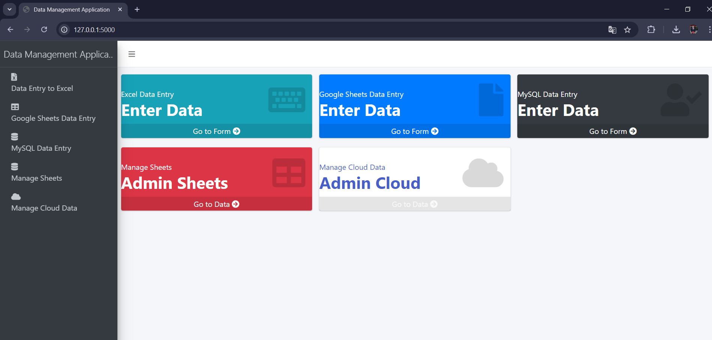
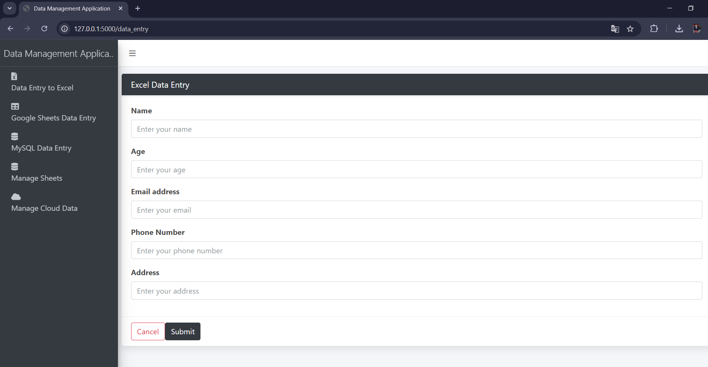
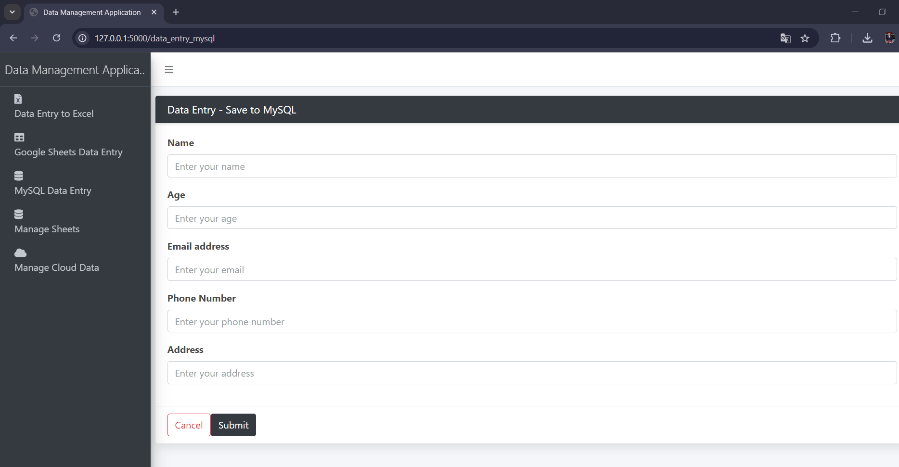
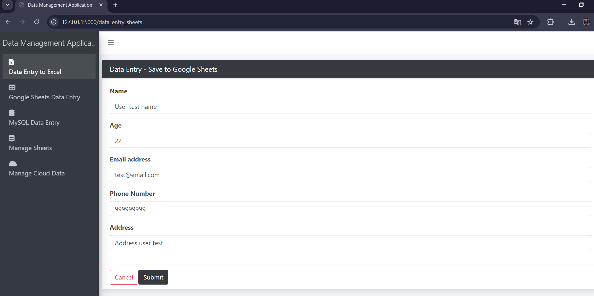

# Data Management Application

This web application, built with Python and Flask, provides a comprehensive solution for managing and visualizing data from various sources including Google Sheets and a MySQL database. It allows users to perform operations such as viewing, editing, deleting, and saving data, both locally and online.

## 1. Features:

### a. Functionality:

- Data Entry: Submit data via forms and save it to Excel, Google Sheets, or a MySQL database.
- View Data: View data stored in MySQL, with options to edit or delete individual records.
- Download Sheets: Download Google Sheets as Excel files.
- Manage Sheets: List and delete Google Sheets documents.
- Error Handling: Inform users about errors or successful operations with appropriate messages.

### b. Setup:

#### Clone the Repository:

        https://github.com/netto14cr/Data_management_application_01.git

#### a. Environment Variables:
Create a .env file in the project root and add your Instagram credentials:

        MYSQL_USER=your_mysql_user
        MYSQL_PASSWORD=your_mysql_password
        MYSQL_HOST=your_mysql_host
        MYSQL_DATABASE=your_mysql_database

#### b.Install Dependencies:
        python -m venv env
        source env/bin/activate  # For Linux/Mac
        .\env\Scripts\activate   # For Windows
        pip install -r requirements.txt

#### c. Database Setup:
In the db folder, there is a file named db.sql. Use this file to create the necessary database schema:
        
        mysql -u your_mysql_user -p your_mysql_database < db/db.sql

#### d. Running the Application:
        python app.py

## 2. Usage:

### a. Home Page:

- Navigate to / to access the main page of the application.

### b. Manage Sheets:

- List Sheets: Access /manage_sheets to view and manage Google Sheets.
- View Sheet Data: Navigate to /view_sheet_data/<file_id> to view data from a specific Google Sheet.
- Download Sheet: Download Google Sheets as Excel files via /download_sheet/<file_id>.
- Delete Sheet: Remove a Google Sheet with the /delete_sheet/<file_id> endpoint.

### c. Data Entry Forms:

- Excel Data Entry: Submit data to Excel through /data_entry.
- Google Sheets Data Entry: Submit data to Google Sheets with /data_entry_sheets.
- MySQL Data Entry: Submit data to a MySQL database at /data_entry_mysql.

### d. Manage MySQL Data:
- View Data: View all records stored in MySQL via /cloud_data.
- View Specific Data: Access detailed views of records through /view_cloud_data/<int:record_id>.
- Edit Data: Modify existing records at /edit_cloud_data/<int:record_id>.
- Update Data: Save changes to records via /update_cloud_data/<int:record_id>.
- Delete Data: Remove records from MySQL using /delete_cloud_data/<int:record_id>.

### e. Technologies Used:
- Python
- Flask
- Google Sheets API
- Google Drive API
- MySQL
- Bootstrap
- HTML/CSS

## 3. Google Sheets Integration Setup:

### a. Google Cloud Console Configuration:

#### 1. **Create a Google Cloud Project:**
   - Go to the [Google Cloud Console](https://console.cloud.google.com/).
   - Click on the **Select a Project** dropdown at the top and then click on **New Project**.
   - Enter a project name and click **Create**.

#### 2. **Enable Google Sheets API:**
   - Navigate to **APIs & Services** > **Library**.
   - Search for **Google Sheets API** and click on it.
   - Click **Enable** to enable the API for your project.

#### 3. **Enable Google Drive API:**
   - Similar to the Google Sheets API, go to **APIs & Services** > **Library**.
   - Search for **Google Drive API** and enable it.

#### 4. **Create a Service Account:**
   - Go to **APIs & Services** > **Credentials**.
   - Click **Create Credentials** and select **Service Account**.
   - Fill in the service account details (name, description) and click **Create**.
   - Assign the **Editor** role to the service account (or a more specific role if necessary) and click **Continue**.
   - Click **Done** to finish creating the service account.
   - Click on the newly created service account and go to the **Keys** tab.
   - Click **Add Key** > **Create New Key**.
   - Select **JSON** and click **Create**. Save the downloaded JSON file to `google/key/credentials.json` in your project directory.

#### 5. **Share Google Sheets with the Service Account:**
   - Open Google Sheets and create or select a sheet you want the service account to access.
   - Share the sheet with the service account email found in your JSON file. This email usually ends with `@<project-id>.iam.gserviceaccount.com`.

#### 6. **Update Environment Variables:**
   - Add the following line to your `.env` file:
        
        GOOGLE_SERVICE_ACCOUNT_FILE=google/key/credentials.json

## 4. Screenshots:

### Homepage
Shows the main page of the application with menu options and buttons for navigating the project.

### Excel Data Entry Form
Displays the form used for entering data into an Excel sheet.

### Completed Excel Data Entry
Shows the completed form for Excel data entry alongside an .xlsx file displaying the stored data.

### MySQL Data Entry Form
Displays the form for entering data into a MySQL database.

### Completed MySQL Data Entry
Shows the completed MySQL data entry form with correct data input.

### Google Sheets Management
Features a table listing existing Google Sheets documents, with options to view, manage, and download each document.

### Google Sheets Document View
Shows a selected Google Sheets document in a tabular format with options to return, download, delete, or edit.

### Google Sheets Data Entry Form
Displays the form for entering data into a Google Sheets document.

### Editing Google Sheets Entry
Shows the form for editing an existing Google Sheets entry, with fields for updating the document's data.

### Google Sheets Entry and Download
Illustrates the Google Sheets entry form and an open .xlsx file showing the downloaded data.

### Cloud Data Management
Features a table displaying documents created through the MySQL data entry form, with options to view, edit, or delete.

### Editing Cloud Data Record
Shows the form for editing a cloud-stored record, with options to update fields and cancel or confirm changes.

### Database Record View
Displays a record view with details from the database, demonstrating that the record is stored correctly.

## 5. LICENSE:
This project is licensed under the MIT License for educational use only. For professional or commercial use, please obtain proper licensing. See the LICENSE file for more details.
